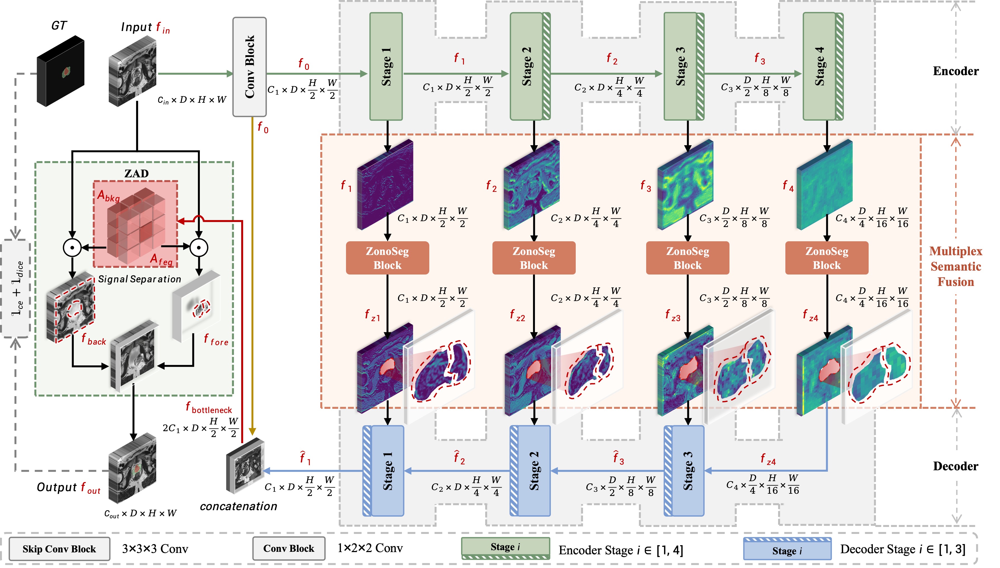
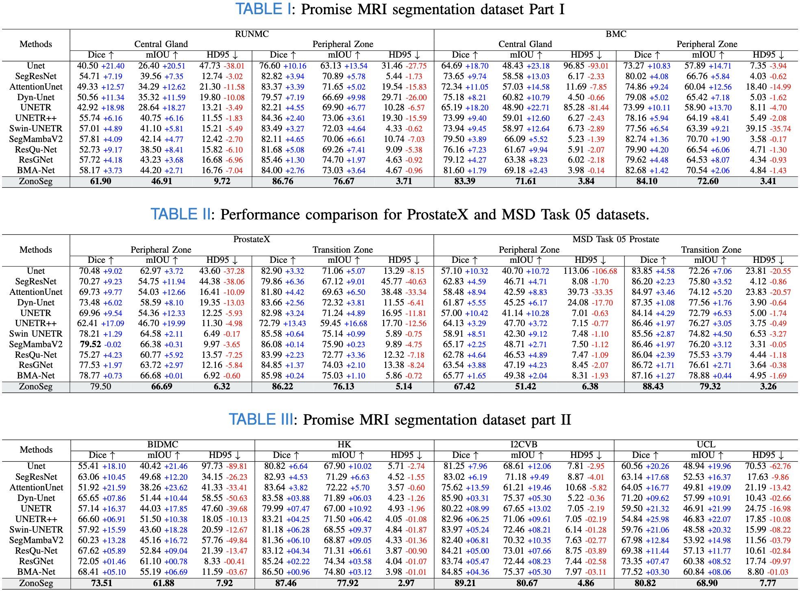
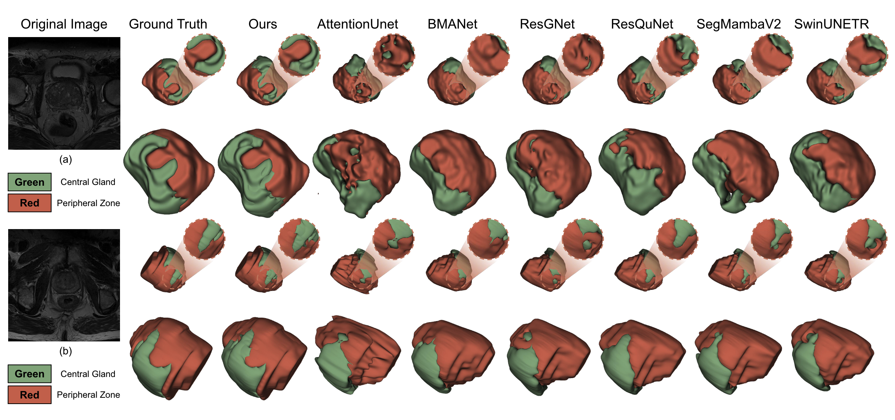
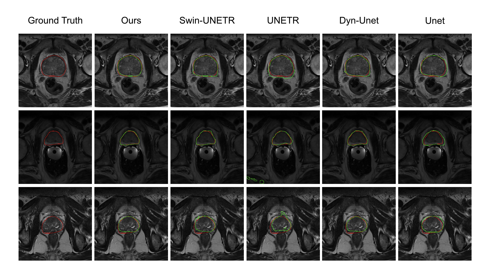

# ZonoSeg: A Zonal-aware Prostate Segmentation Framework on 3D MRI images

> More details of this project will be released soon.

# Network Architecture
ZonoSeg is a novel zonal-aware segmentation framework that addresses the critical challenge of ambiguous boundary delineation in 3D prostate MRI through hierarchical feature learning enhanced with probabilistic boundary modeling, specifically targeting the complex transition between the central gland and the peripheral zone. ZonoSeg comprises two key innovations: a boundary-aware skip-connection block that generates continuous probabilistic boundary fields to model anatomical uncertainty, and a zone-adaptive decoupling head that explicitly separates boundary and region representations to resolve ambiguities at the critical zonal interface.

# Data Description
Dataset Name: Prostate MRI Segmentation, ProstateX and MSD Task05 Prostate dataset

# Benchmark
## Prostate MRI Segmentation dataset
Performance comparative analysis of different network architectures for middle ear segmentation in the Prostate MRI Segmentation, ProstateX and MSD Task05 Prostate dataset.

# Visualization

## Qualitative visualizations of the proposed ZonoSeg and baseline approaches. 
Qualitative visualizations of the ZonoSeg and baseline approaches under ProstateX dataset.

## 2D boundary visualization comparison of ZonoSeg with other methods.
Qualitative 2D boundary visualization on representative axial slices, comparing predicted central-gland and peripheral-zone contours with ground-truth edges

